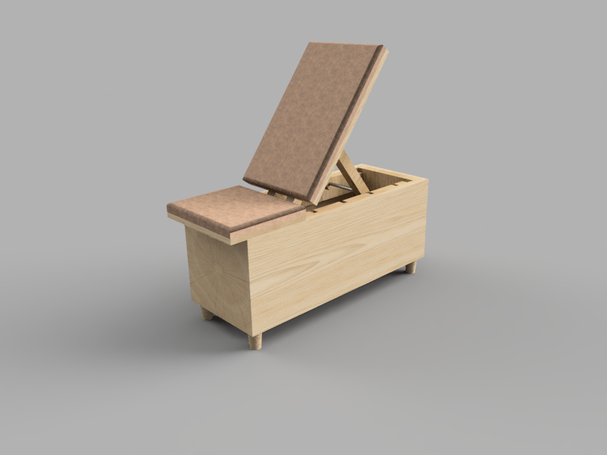
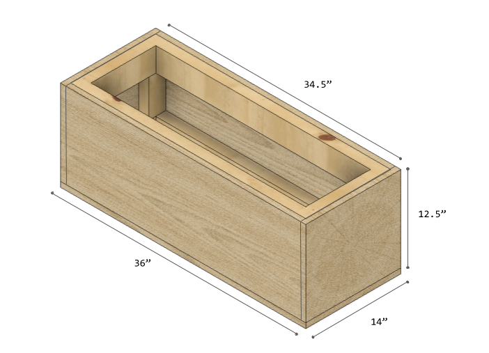
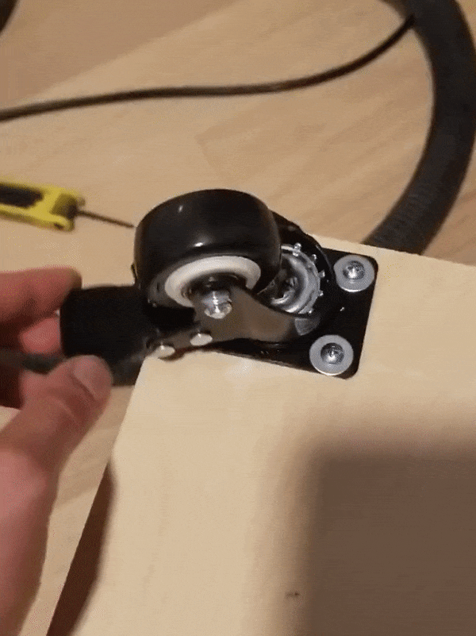

## Project Difficulty 

- 8/10 (Not for the faint of heart)

After COVID struck and gyms shut down it became pretty clear that I'd need something better than my flimsy piano bench to use as a workout bench. 
There was an influx of DIY versions of home workout equipment being advertised on instagram and youtube but nothing quite met all my requirements. 
This design represents a lot of thinking and planning and takes inspiration from some of the best other DIY designers I could find online. I'll post some of my favorite other benches below.

## Project Requirements

- Sturdy workout that can support my weight
- Has an adjustable back for incline and seated exercises
- Stores fitness equipment easily out of view
- Mobile enough for moving in and out of the way
- Looks nice sitting out

## Supplies

- 3/4" Plywood (I used Baltic Birch)
- Standard 2x4s 
- Standard 2x2s
- 3/4" Galvanized Steel Pipe
- Pocket Screw Jig
- Long Wood Screws
- Heavy Duty Furniture Casters
- Water-Based Polyurethane (or whatever finish you want)
- 1" Foam Badding
- 2 yards of heavy-duty vinyl / faux leather

## Required Equipment

- Circular Saw / Table Saw
- Track Saw Guile
- Jigsaw
- Drill
- Hack Saw
- Sandpaper
- Measuring Tape
- Level
- File

## Cutlist 

### Main Structure
- Four (4) 31.5" 2x4 (A)
- Four (4) 12.5" 2x4 (B)
- Four (4) 5.5" 2x4 (C)
- Two (2) 12.5" x 14" 3/4" Baltic Birch (D)
- Two (2) 12.5" x 34.5" 3/4" Baltic Birch (E)
- One (1) 14" x 36" 3/4" Baltic Birch (F)
---
### Adjustable Assembly
- Two (2) 21" 2x2
- Two (2) 12" 2x2
- Two (2) 11.5" #8 Threaded Steel Rod
- One (1) 9" #8 Threaded Steel Rod
---
### Seat
- One (1) 14" x 23" 3/4" Baltic Birch (G)
- One (1) 14" x 12" 3/4" Baltic Birch (H)
- Two (2) 1.5" x 4" 3/4" Baltic Birch
- One (1) 1.5" x 6" 3/4" Baltic Birch

## Design

The thing that I found lacking with the other DIY home workout benches is that they either had storage or were adjustable. 
None of them did both. This bench could much more easily be made as just a flat bench with storage. The final dimensions of this 
bench is supposed to be 3ft long by 14" wide and roughly 18" high (with the cushion). 

## Steps

1. First step is to build the inner frame that will provide the structure to the bench. This is made of 2x4s that are butt jointed 
together using pocket screws. The frame won't be visible from the outside so it doesn't need to be nice wood. You will use pieces A, B and C. 

    

2. Next cut and attach the outer walls (Pieces D, E and F) using a combination of pocket screws in the corners and screws between the baltic birch and the inner frame. 
Make sure to hide the pocket screws in the interior. 

    
    
3. Attach some [heavy duty casters](https://www.amazon.com/Swivel-Caster-Wheels-Locking-Polyurethane/dp/B06Y49D2J2/ref=sxin_10?ascsubtag=amzn1.osa.b54557a1-1e55-4d28-9e82-050295431ec6.ATVPDKIKX0DER.en_US&creativeASIN=B06Y49D2J2&cv_ct_cx=heavy+duty+casters&cv_ct_id=amzn1.osa.b54557a1-1e55-4d28-9e82-050295431ec6.ATVPDKIKX0DER.en_US&cv_ct_pg=search&cv_ct_wn=osp-single-source-gl-ranking&dchild=1&keywords=heavy+duty+casters&linkCode=oas&pd_rd_i=B06Y49D2J2&pd_rd_r=1ea42fce-1bd8-46e9-ad64-c66519d68a91&pd_rd_w=hFAkR&pd_rd_wg=U9Xl8&pf_rd_p=69c78df1-b3ce-40ba-9ee0-ecaea903b011&pf_rd_r=9GNK33PT41BMV16CP4PX&qid=1598223053&sr=1-2-d9dc7690-f7e1-44eb-ad06-aebbef559a37&tag=cb-osp-20) 
to the bottom of the base. In the renderings I'm showing feet but I'd always planned to use locking casters. Make sure to take into account
the height of the casters for the final height. The ones for this design were 2.5" inches tall and the entire design takes that into consideration.

    
    
4. Next we're going to create the adjustment assembly. This part required me a good amount of adjustments to get everything to work. 
    
## There you have it

Thanks for reading. 

## Other Makers Links

- [Instructables: Adjustable Bench](https://www.instructables.com/id/Weight-Bench-5-positionFlatIncline-doubles-as-/)
- [Jamie Castiglio: Bench with Storage](https://jaimecostiglio.com/diy-workout-bench-with-storage/)
- [Homemade Modern:  Gym in a Box](https://www.youtube.com/watch?v=H2UVZhbX074)
